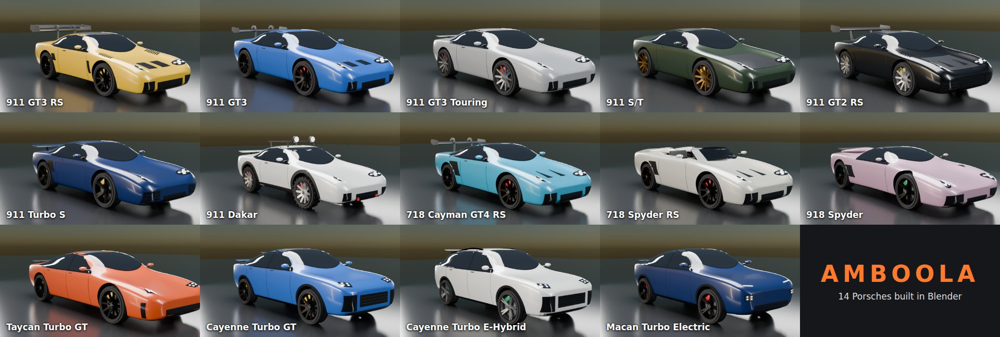
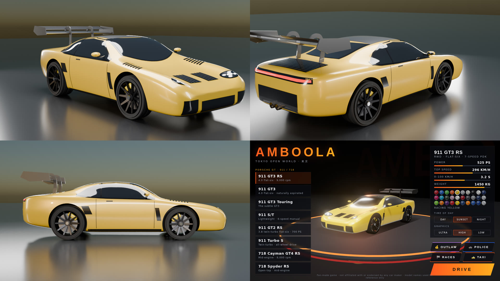
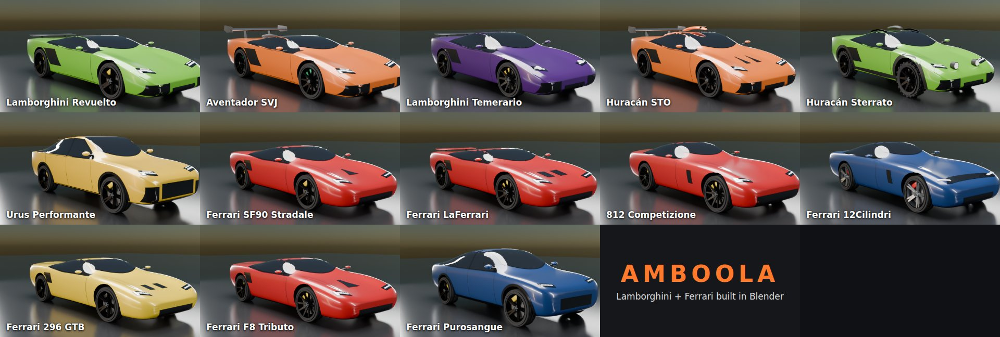
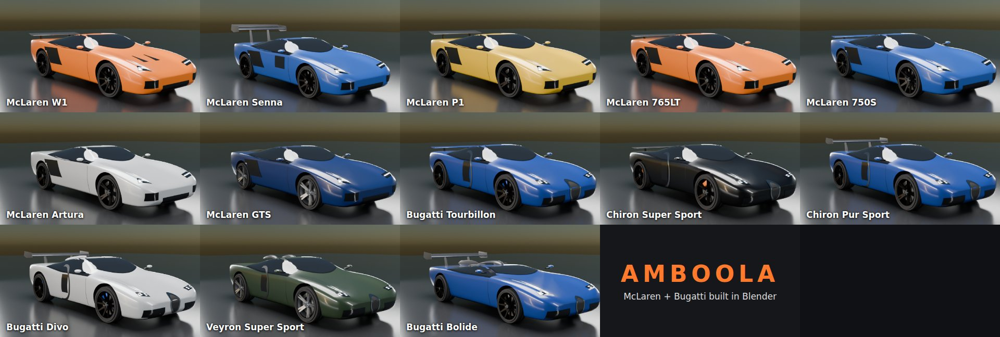
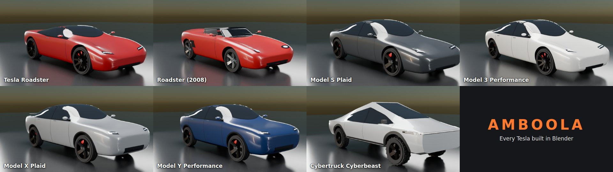
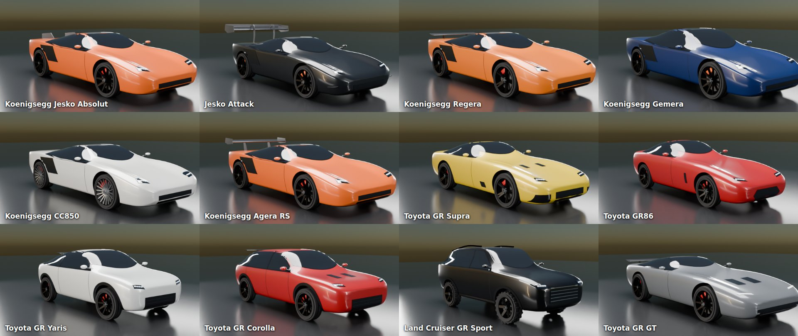

# AMBOOLA — Tokyo Open World

A browser driving game: take 59 cars (Porsche GT cars and SUVs, the whole Tesla lineup, Lamborghinis, Ferraris, McLarens, Bugattis, Koenigseggs and Toyota GR cars) through an open-world, Tokyo-inspired city covered in neon signs and Porsche billboards.

## 🎮 [PLAY NOW → raggykrav-svg.github.io/Amboola](https://raggykrav-svg.github.io/Amboola/)

Free, in your browser: no download, no install, no account. It works on computers (keyboard or gamepad) and on phones and tablets (touch controls). A fast computer gives the best graphics; pick **Low** graphics in the garage on older laptops and phones.

**▶ Watch the trailer:** [media/amboola-trailer.mp4](media/amboola-trailer.mp4) (66 s with sound, recorded from the real game: drag races, all the Blender cars, buying and upgrading, races, drift, outlaw and police)

[](media/amboola-trailer.mp4)

Everything is in one file, `index.html`: the city, the cars, the physics and the sound. No build step and no install.

## How to play

**Option 1 — just open it:** download `index.html` and double-click it. Chrome, Edge, Firefox and Safari all work.
An internet connection is needed the first time, because Three.js and the fonts load from a CDN.

**Option 2 — GitHub Pages:** in the repo go to *Settings → Pages*, choose *Deploy from a branch*, pick the branch and `/ (root)`,
then open the URL it gives you.

**Option 3 — local server:** `npx http-server .` and open `http://localhost:8080`.

## Money

You start with **$20,000** and a free **Toyota GR86**. Every other car costs its real US price, from $30,000 for the GR86 to $5.8 million for the Bugatti Divo. In the garage, cars you don't own show their price, and the big button says **BUY** when you can afford one, or how much more you need. You can only drive, race or do jobs in cars you own.

Ways to earn money:
| Job | Pay |
|---|---|
| **Races** | 1st 5% of your car's price (at least $10,000), 2nd 3% (≥ $5,000), 3rd 2% (≥ $3,500), others $1,500+. Faster, pricier cars win more. |
| **Drag races** | Win: 3% of your car's price (at least $7,500; ×1.6 for the half mile). Lose: $750. Red light: nothing. |
| **Taxi** | VIP fares, about $350–2,000 each, plus a tip for arriving fast without crashing |
| **Outlaw** | Money safes hold $2,000–8,000; you keep what you stash at a hideout (busted = you lose what you carry) |
| **Police** | Arrest the outlaw: his cash + a $3,500 reward |
| **Drift** | Drift and skill chains pay 15¢ per point when the chain is banked |

Your wallet shows in yellow at the top right while driving and next to the title in the garage. It is saved in the browser. Press **💾 SAVE & QUIT** in the garage to save everything (money, cars, upgrades, your car and its paint colour, time of day) and stop. Next time you open the game, you carry on where you left off. Older saves that still held yen are converted once, at ¥150 = $1.

## Upgrades

Press **🔧 UPGRADE** in the garage (on a car you own) to tune it. Each car has its own upgrades:
| Upgrade | Levels | Per level |
|---|---|---|
| **Engine** | 5 | +7% power (more acceleration and top speed) |
| **Tires** | 5 | +5% grip: less wheelspin, faster corners, shorter braking |
| **Turbo** | 3 | +6% power, stacks with the engine |
| **Weight** | 3 | −3.5% weight |
| **Spoiler** | 3 | more downforce, so more grip at high speed |
| **Nitro** | 3 | a 2.5 / 3.5 / 4.5 s tank. Hold **SHIFT** (or **X**, the **N₂O** touch button, or gamepad **B**) for a big extra push that works even in grip-limited hypercars. It refills slowly. |

A fully tuned car with nitro is about 1–2 s quicker over the quarter mile.

Each level costs a bit more than the last, and the price scales with the car. The panel shows your power, top speed, 0–100, quarter-mile time and grip before and after, measured with the game's real physics. For example, a fully tuned GR86 (Engine 5, Tires 3) drops from 14.1 s to 12.8 s over the quarter mile.

## Drag races

**💀 Drag bosses:** three quarter-mile boss races against **fully upgraded** cars that react fast at the green. Each one unlocks after you beat the one before. A boss pays its big prize the first time you win, and 10% on rematches:
| Boss | Rival | Prize | You'll need about |
|---|---|---|---|
| 1 · Street King | maxed Toyota GR Yaris (10.96 s) | $40,000 | an upgraded GR Supra |
| 2 · Midnight Turbo | maxed Porsche 911 Turbo S (8.73 s) | $300,000 | a tuned supercar with nitro |
| 3 · The Final Boss | maxed Bugatti Bolide (7.08 s) | $2,500,000 | a maxed hypercar, nitro and a perfect launch |

The **🚦 DRAG RACE** button in the garage (or **RACES → 🚦 DRAG**) takes you to the **Amboola Dragway** north of Fujimi Speedway, a two-lane strip with a grandstand and a timing board. Pick the **Quarter Mile** (402 m) or the **Half Mile** (805 m). Your rival is a car with a similar quarter-mile time (a touch quicker), driven by the same physics as yours.
- **The tree:** the two white stage lights come on, then the three ambers, then **green**. Hit the throttle on green.
- **Red light:** if you press the throttle during the ambers, you jumped the start and lose.
- **Results:** reaction time, ET (elapsed time), trap speed and total for both cars. Your best ET per distance is saved.
- **Tip:** manual-gearbox cars need you to shift (Q/E). Press **M** for auto, or practise your shifts.

## Missions, daily bonus, selling cars

- **🏆 Missions** (garage button): 16 goals that pay automatically when you reach them, with a banner and a sound.
  - **Driving:** win a drag race ($2,000), win 10 drag races ($25,000), win a circuit race ($5,000), win 5 circuit races ($40,000), deliver 10 taxi passengers ($8,000), arrest 3 outlaws ($15,000), stash $50,000 as the outlaw ($20,000), bank a 2,500-point drift chain ($10,000).
  - **Building your garage:** max every upgrade on one car ($30,000), own 5 cars ($25,000), own a $1M+ car ($100,000), own a Bugatti ($250,000), have $1,000,000 in your wallet ($50,000).
  - **Exploring:** drive the Wangan Highway to Amboola Beach ($10,000), climb the Snow Pass to the Ski Village ($15,000).
  - **Final goal:** beat all 3 drag bosses ($500,000).
- **📅 Daily bonus:** come back on a new day and collect free money. It grows every day you keep your streak: $5,000 on day 1, up to $20,000 on day 7 and after. Miss a day and the streak starts again.
- **💸 Sell cars:** the red **SELL** button under UPGRADE sells the car for 60% of its price plus half of what you spent upgrading it. Tap twice to confirm. You always keep at least one car.

## Customizing · カスタム

Pick a car you own in the garage and press **🎨 CUSTOMIZE**. Everything is free, shows on the turntable straight away, is saved for that car, and goes with you when you drive.
- **Rims:** gloss black, satin black, silver, gunmetal, bronze, gold, white, red, neon blue or chrome.
- **Brake calipers:** red, yellow, acid green, blue, orange, pink, black or silver.
- **Window tint:** light, limo black, blue mirror, gold mirror or an oil-slick rainbow.
- **Decals & stickers:** racing stripes, a side stripe, a race number (each car has its own number), flames, a Tokyo livery with 東京 on the doors, a checkered band, or a set of sponsor stickers. Choose from 8 decal colours.
- **RESET** puts the car back to stock. Selling a car also clears its customizing.

The decals are painted inside the car's own paint, so they follow every curve and never flicker or float off the body.

## Controls

| Key | Action |
| --- | --- |
| `W` / `↑` | Throttle |
| `S` / `↓` | Brake, then hold to reverse |
| `A` `D` / `←` `→` | Steer |
| `Space` | Handbrake (drift) |
| `C` | Camera: chase / far chase / hood / bumper |
| `M` | Automatic ↔ manual gearbox |
| `Q` / `E` | Shift down / up (manual) |
| `T` | Time of day: day / sunset / night |
| `Y` | Weather: rain / clear |
| `R` | Put the car back on the road |
| `P` / `Esc` | Pause, change car, sound on/off |
| `H` | Show controls |

Gamepads work too: RT/LT for throttle and brake, the left stick steers, A is the handbrake, Y changes camera, LB/RB shift, and Start pauses. On phones and tablets, touch buttons appear on screen.

## Cars

**GT:** 911 GT3 RS · 911 GT3 · 911 GT3 Touring · 911 S/T · 911 GT2 RS · 911 Turbo S · 718 Cayman GT4 RS · 718 Spyder RS · 911 Dakar
**Hypercar:** 918 Spyder
**Electric:** Taycan Turbo GT
**SUV:** Cayenne Turbo GT · Cayenne Turbo E-Hybrid · Macan Turbo Electric
**Lamborghini:** Revuelto · Aventador SVJ · Temerario · Huracán STO · Huracán Sterrato · Urus Performante
**Ferrari:** SF90 Stradale · LaFerrari · 812 Competizione · 12Cilindri · 296 GTB · F8 Tributo · Purosangue
**McLaren:** W1 · Senna · P1 · 765LT · 750S · Artura · GTS
**Bugatti:** Tourbillon · Chiron Super Sport · Chiron Pur Sport · Divo · Veyron Super Sport · Bolide
**Koenigsegg:** Jesko Absolut · Jesko Attack · Regera · Gemera · CC850 · Agera RS
**Toyota:** GR Supra · GR86 · GR Yaris · GR Corolla · Land Cruiser GR Sport · GR GT
**Tesla:** Roadster (next-gen) · Roadster (2008) · Model S Plaid · Model 3 Performance · Model X Plaid · Model Y Performance · Cybertruck Cyberbeast

The Teslas have their own body shapes: glass roofs, smooth grille-less noses, and a flat-panel Cybertruck with a full-width light bar. They also get extra paints: Pearl White, Ultra Red, Stealth Grey, Quicksilver, Deep Blue, and brushed Stainless Steel for the Cybertruck. The next-gen Roadster uses Tesla's announced prototype figures (0–100 km/h in 1.9 s, 400 km/h).

The Lamborghinis have sharp, angular wedge bodies. The Ferraris come in three shapes: curvy mid-engine berlinettas, long-nosed front-engine V12 GTs, and the Purosangue. Both brands get their own paints: Verde Mantis, Arancio Borealis, Viola Pasifae, Rosso Corsa, Giallo Modena and Blu Pozzi.

The McLarens have a low mid-engine body with a teardrop cabin. The Bugattis have a wide, rounded body with the horseshoe grille, and the Bolide is a very low track car. The new paints are Papaya Orange, Volcano Blue, Bugatti Blue and Argent Silver. The Bugatti Tourbillon (2.0 s to 100 km/h, 445 km/h) and the track-only Bolide (500 km/h) are the fastest cars in the game.

### The Blender Porsches



All 14 Porsches are real 3D models built in [Blender](https://www.blender.org/). Each one is made entirely by Python script, at its real dimensions (length, width, height, wheelbase and wheel sizes). Each car has its own details:

| Car | What makes it look right |
|---|---|
| **911 GT3 RS** | Swan-neck wing with DRS flap, hood vents, fender louvres, carbon roof |
| **911 GT3** | Narrower body, single swan-neck wing, hood nostrils |
| **911 GT3 Touring** | No wing, just a pop-up spoiler, silver window trim |
| **911 S/T** | Carbon hood and roof, ducktail, bronze magnesium wheels |
| **911 GT2 RS** | Huge wing on uprights, NACA ducts, fender gills, big titanium pipes |
| **911 Turbo S** | Wide body with big intakes in the rear fenders, active wing, square pipes |
| **911 Dakar** | Raised on all-terrain tyres, black arch cladding, roof rack with spotlights, red tow hooks |
| **718 Cayman GT4 RS** | Mid-engine body, big side intakes, air intakes in the rear side windows, swan-neck wing |
| **718 Spyder RS** | Open top with seats and steering wheel, low windscreen, humps behind the seats, ducktail |
| **918 Spyder** | 1.17 m tall, carbon roof panels, flying buttresses, exhausts that exit on top |
| **Taycan Turbo GT** | 4 doors, 4-point LED headlights, carbon roof, aero wheels |
| **Cayenne Turbo GT** | Coupé roofline, carbon roof, roof and tailgate spoilers, centre titanium pipes |
| **Cayenne Turbo E-Hybrid** | Tall SUV roof with roof rails and spoiler, twin double pipes |
| **Macan Turbo Electric** | Split headlights (thin LED strip on top, main lights below), glass roof, no exhausts |

They all have the full-width light bars, gloss-black window trim, forged wheels and coloured brake calipers.

In the game you can still change the paint, the brake lights and headlights still glow, and the wheels still spin and steer. If a model can't load, the game falls back to the old built-in shape.



**How the models are made:**
- [`models/blender/carkit.py`](models/blender/carkit.py) holds the building blocks:
  - **Body:** smooth curved surfaces lofted through a table of cross-sections.
  - **Cut-outs:** wheel wells and cockpits cut out of the body.
  - **Details:** glass, vents and lights projected onto the body surface.
  - **Parts:** wings, swan necks, mirrors, exhausts and wheels.
- [`models/blender/porsches.py`](models/blender/porsches.py) describes each car using those blocks.

To change a car, edit its section and rebuild it ([Blender 4.2](https://www.blender.org/download/) or newer):

```bash
blender -b --factory-startup --python models/blender/porsches.py -- --car gt3rs              # one car
blender -b --factory-startup --python models/blender/porsches.py -- --car all                # all 14 (about 2 minutes)
blender -b --factory-startup --python models/blender/porsches.py -- --car 918 --renders renders/ --sheet
```

Each car is written to `models/<id>.glb`, plus `models/<id>.glb.js` (the same model as a script file, so double-clicking `index.html` still works).
- `--renders` saves studio pictures from Blender's Cycles renderer.
- `--sheet` puts several views in one picture.
- `--blend car.blend` saves a file you can open and edit in Blender.

### The Blender Lamborghinis and Ferraris



The 6 Lamborghinis and 7 Ferraris are Blender models too. They are made the same way, in [`models/blender/supercars.py`](models/blender/supercars.py). The Lamborghinis have sharp, folded wedge shapes; the Ferraris have soft, flowing curves.
- **Lamborghini:** Y-shaped LED lights, hexagonal exhausts and black rear grilles.
  - The **Aventador SVJ** and **Huracán STO** get big wings on posts (the STO also has a roof scoop and a shark fin).
  - The **Huracán Sterrato** is raised on off-road tyres, with light pods on the nose and roof rails.
  - The **Urus Performante** is the sharp-edged super SUV.
- **Ferrari:** slim swept headlights.
  - The **SF90** has high-exit pipes and the **LaFerrari** three centre pipes.
  - The **296 GTB** has a ducktail and one centre pipe, and the **F8** has round twin tail lights.
  - The **812 Competizione** has its louvred rear window, and the **12Cilindri** the black band across its nose.
  - The **Purosangue** is the four-door Ferrari.

```bash
blender -b --factory-startup --python models/blender/supercars.py -- --car all     # or --car svj,f8
```

### The Blender McLarens and Bugattis



The 7 McLarens and 6 Bugattis are Blender models too, in [`models/blender/hypercars.py`](models/blender/hypercars.py).
- **McLaren:** teardrop cabins, "eye socket" headlights, and the intake scooped into each door.
  - The **Senna** has a huge two-part wing and glass door panels, and the **P1** a big active wing.
  - The **765LT** has a longtail lip and four centre pipes, and the **Artura** one high centre pipe.
  - The **GTS** is the grand tourer with a glass hatch.
- **Bugatti:** the horseshoe grille, the C-shaped line on each side, a spine over the roof, four-point lights and quad centre pipes.
  - The **Chiron Pur Sport** and **Divo** have fixed wings; the Divo also has a roof fin and fin-shaped tail lights.
  - The **Veyron** has round tail lights and roof scoops.
  - The **Bolide** is a 1 m-tall track car with X lights, a roof scoop, a shark fin and a giant wing.

```bash
blender -b --factory-startup --python models/blender/hypercars.py -- --car all     # or --car senna,bolide
```

### The Blender Teslas



The 7 Teslas are Blender models too, in [`models/blender/teslas.py`](models/blender/teslas.py). That makes **every one of the 47 cars** a Blender model. The Teslas have smooth noses with no grille, slim swept headlights, glass roofs, flush door handles and aero wheels.
- The fronts have LED eyebrow lamps with twin projectors, a lower intake with a body-coloured bar, and air curtains at the corners.
- The **Model S** and **Model 3** are sleek sedans; the **Model Y** and **Model X** are crossovers. The X has its huge windscreen running over the front seats and falcon-wing door seams.
- The **next-gen Roadster** has a removable glass roof, and the **2008 Roadster** is an open two-seater with a roll hoop.
- The **Cybertruck** is built from flat stainless-steel panels with sharp edges, full-width light bars front and back, black arch cladding and off-road tyres.

```bash
blender -b --factory-startup --python models/blender/teslas.py -- --car all     # or --car cyberbeast
```

### Koenigsegg and Toyota



Two more brands, built in Blender the same way: [`models/blender/koenigsegg.py`](models/blender/koenigsegg.py) and [`models/blender/toyota.py`](models/blender/toyota.py).
- **Koenigsegg:** Jesko Absolut (480 km/h, rear fins), Jesko Attack (huge swan-neck wing), Regera (Direct Drive hybrid), Gemera (four-seat mega-GT), CC850 (6-speed manual, turbine wheels) and Agera RS (the 447 km/h record car). They share a narrow bubble canopy with a carbon targa roof, ring tail lights and a high centre exhaust.
- **Toyota GAZOO Racing:** GR Supra (turbo straight-six, ducktail), GR86 (boxer, manual), GR Yaris and GR Corolla (rally hot hatches, manual, AWD), Land Cruiser GR Sport (raised on off-road tyres, chrome-bar grille, roof rails) and GR GT (front-mid V8 hybrid flagship).

They have their own engine sounds: the Supra's straight-six, the GR86's boxer rumble and the GR Yaris/Corolla three-cylinder. They also bring new paints: Tang Orange, Naked Carbon, Emotional Red, Nitro Yellow and Precious Metal.

Each car's physics is built from its real published figures: power, weight, redline, top speed, drivetrain and gear count. From those the game works out a torque curve, gear ratios and drag. For example, the GT3 RS reaches 100 km/h in about 3.2 s. The cars also have their own gearboxes (PDK, manual or single-speed EV), rev limiters, traction limits, downforce, brake distances, drifting and body roll. There are 30 paint colours.

## The world

- A 1.6 × 1.6 km city grid with left-hand traffic, as in Japan. Taxis, kei cars, vans and trucks drive around, stop for you and turn at junctions.
- A scramble crossing with giant video screens that cycle through the ads, plus rooftop and wall billboards.
- Vertical neon signs, vending machines, street lamps and cherry-blossom parks.
- A Tokyo-Tower-style landmark, a temple with a pagoda and torii gates, and an elevated expressway (Shuto) with its own traffic.
- A harbour district by the sea, and Mt. Fuji on the horizon.
- The Amboola GT Center showroom, where you start.
- **30 Amboola boards** to smash, **6 speed traps**, and **skill chains** for drifting, near misses and high speed.

## Map, search and GPS

**Click the minimap**, or press **N** (also P → MAP · SEARCH, or the gamepad Back button), to open the full map of the city, the mountain and all six race tracks.

- **Search** by typing in the box, in English or Japanese: districts (Shibuya 渋谷, Ginza 銀座, Akihabara…), landmarks (Tokyo Tower, Sensō-ji Temple, Scramble Crossing, Amboola GT Center), the Mt. Amboola viewpoint (展望台), race tracks and speed traps. Press **Enter** to pick the first result.
- **Drop a pin** by clicking anywhere on the map. Pins snap to the nearest road, the mountain road or a track.
- **Move around:** drag to pan, use the mouse wheel or **+ / −** to zoom, **◎** centres on your car and **⤢** shows the whole map.
- Each place shows its distance by road, and three choices:
  - **SET ROUTE:** blue arrows on the road and a blue line on the minimap guide you there, including over the mountain. A bar at the top shows the distance left, **TURN AROUND** tells you when you're facing the wrong way, and **ARRIVED · 到着** shows when you get there.
  - **TRAVEL HERE:** fast travel. You appear there straight away.
  - **🏁 RACE** (for tracks): starts that race.

## Outlaw

Pick any car in the garage and press **💰 OUTLAW**, or choose **P → OUTLAW** while driving.

- **Steal:** green money safes are hidden all over the city, with light beams and green squares on the minimap. Drive through one to crack it for ¥3,000–12,000.
- **The police come for you:** every theft alerts them. Police cars with flashing light bars and sirens chase you through the streets, and more come as you carry more cash (up to 3).
- **Don't get caught:** if a police car pins you while you're stopped or crawling, the **BUSTED** bar fills and they take everything you're carrying. Get more than 450 m away to lose them.
- **Take it to a hideout:** press **G** or the **🏠 HIDEOUT ROUTE** button, and purple arrows on the road lead you to the nearest hideout (隠れ家). Stop there to stash the money for good. The police can't arrest you at a hideout.

Your stashed total is saved. **P → END OUTLAW** stops.

## Police

Pick any car in the garage and press **🚓 POLICE**, or choose **P → POLICE** while driving. Now you're the one doing the chasing.

- **Find the outlaw:** an AI outlaw in a fast sports car (a 911 Turbo S, McLaren W1, Ferrari and so on) is cracking the money safes around the city. Red arrows on the road and a flashing red-and-white dot on the minimap lead you to him. The bar at the top shows his car, his distance, how much money he has, and whether he's **LOOTING**, **FLEEING** or **ESCAPING**.
- **He runs:** when you get close he flees. Once he has enough money he races to a hideout.
- **Catch him:** just **touch his car** with yours. He's arrested on the spot and **you get all the money he had**, plus a ¥5,000 reward.
- **Hideouts are safe for him:** you **can't arrest him at a hideout** (隠れ家). If he gets there with the money, he stashes it and gets away. Then a new outlaw appears somewhere in the city.

Your police rewards are saved. **P → END POLICE DUTY** stops.

## Car commercials · 広告 📺

The game plays a short TV-style ad for a car:
- **When you open the game:** a different Lamborghini each time (Revuelto, Aventador SVJ, Temerario, Huracán STO…).
- **When you buy a car:** your new car, in your paint and with your custom parts, ending with **NOW IN YOUR GARAGE**.

Each ad is about 13 seconds long and has four shots, with letterbox bars and flash cuts:
1. A dark studio, with one light sweeping over the car and the brand's tagline.
2. The car racing at you down a rainy, neon-lit Tokyo street at night, with the name and engine.
3. A side tracking shot, with power, 0–100 and top speed counting up.
4. A hero turntable shot with the title card and price.

You hear the car's own engine. When the game first opens, tap **🔊 TAP FOR SOUND** to switch the sound on. Skip at any time with **SKIP**, Esc, Enter or Space. The ads are made up for this fan game and are not real ads from any car maker.

## Weather · rain 🌧

Pick **🌧 Rain** under *Weather* in the garage, press **Y** while driving, or use **WEATHER** in the pause menu. It works in every time of day, but night rain in the city is the one to see.
- **Rain:** streaks fall around you and slant when you drive fast. The sky turns grey, the haze gets thicker, and at night lightning flashes over the city, followed by thunder a moment later.
- **Wet roads that reflect the neon:** the streets get wet over a few seconds. Signs, street lamps, headlights and your own car are mirrored in the road and smeared like they are on real wet asphalt. Puddles give sharper reflections, and raindrops make little ripples in them. The highway and mountain roads get a wet shine too.
- **Driving:** wet roads have 18% less grip, so brake earlier and be gentle on the throttle. The tyres throw up spray behind the car and hiss on the wet road, and you hear the rain (quieter in the hood camera).
- **Graphics:** on Medium/High/Ultra the reflections are real. On Low they're a cheaper sheen, so phones stay smooth.

## Wangan Highway & Amboola Beach 🏖

- **Getting there:** drive east along the harbour road (the street just north of the seawall) to the green **ETC toll gate**.
- **The Wangan Highway (湾岸線):** six lanes with a central barrier, concrete barriers on both sides, street lamps and green gantry signs. It runs along the coast on a viaduct, with traffic going both ways at 80–120 km/h, driving on the left like in Japan. The traffic slows down behind you.
- **Amboola Bay Bridge:** a white suspension bridge across the bay, about 30 m above the water, with lights along its cables at night.
- **Amboola Beach:** an island beach town. You can drive anywhere in town:
  - streets of pastel shops and hotels, with neon signs that light up at night (かき氷, SURF SHOP, ラーメン, BEACH BAR…);
  - palm trees, a sandy beach with umbrellas, towels, a lifeguard tower and a volleyball net;
  - a long wooden pier you can drive along to a Ferris wheel at the end;
  - a lighthouse whose beam sweeps the bay at night.
- **First visit:** +2,000 skill points and the **Beach Trip** mission.

## Shirayuki Snow Pass ❄️

- **Getting there:** drive out of the north edge of the city through the red gate marked **白雪山 SNOW PASS**. The road crosses the plain between Kanto Short Circuit and Fujimi Speedway to a snowy mountain.
- **The pass:** five long switchback legs with hairpin bends, about 5 km long and climbing to about 210 m. It has yellow guardrails, red-and-white snow poles and snow-laden pine forest.
- **Driving it:** it snows on the mountain, and the snowy road has 20% less grip. With **Y**/Rain on, the snowfall gets heavier.
- **Shirayuki Ski Village:** a square of wooden chalets with snowy roofs and warm lit windows: a ski lodge, an onsen with steam rising, a ramen shop, a café and a ski rental. There's a lit tree in the middle, and a chairlift runs up to the summit.
- **First visit:** +2,000 skill points and the **Snow Chaser** mission.

The map (**N**) lists all of it: Amboola Beach, Beach Pier, Wangan Highway, Amboola Bay Bridge, Shirayuki Ski Village and Snow Pass. You can set a GPS route through the right gate, or fast-travel there. **R** puts you back on the highway or the pass.

## Mt. Amboola

There's a big forested mountain on the bay, south-west of the city. You can see it from the streets.

- **Getting there:** drive west to the red torii gate at the end of the west-edge road; the minimap shows it. Through the gate, a 2.8 km road winds twice around the mountain as it climbs, with guardrails and pine forest on both sides.
- **Driving it:** hills feel real. Climbing slows the car and going downhill speeds it up, and the car tilts with the road.
- **The top:** a viewpoint plaza at 208 m with railings, telescopes, a Japanese shelter, a torii gate and lamps. The haze clears as you climb, so the whole city and the sea are in view. You get +2,000 skill points the first time you reach the summit.
- **The scenic view:** stop on the plaza and wait about 2 seconds. The camera glides out over the railing and slowly pans across Tokyo. It's especially good at sunset and at night. Press any drive key to carry on.
- **Getting back:** drive back down and through the gate, and you're in the city again. **R** puts you back on the mountain road.

## Races

There are six race tracks just outside the city. You can see them from the city streets.

| Track | Where | Length | Laps |
|---|---|---|---|
| **Amboola Grand Prix Circuit** | East of the city | 4.05 km, technical, with lots of corners | 3 |
| **Fujimi Speedway** | North, under Mt. Fuji | 4.01 km with a 1.4 km main straight | 3 |
| **Bayside Oval** | West | 2.47 km, flat out | 5 |
| **Akagi Mountain Pass** | North-east | 3.41 km, narrow, with hairpins and walls right at the edge | 2 |
| **Kanto Short Circuit** | North-west | 1.93 km, tight club circuit | 4 |
| **Sakura Ring** | Far east | 8.54 km, flowing endurance loop | 1 |

**How to start a race:**
- **From the garage:** pick your car, press **🏁 RACES**, and choose a track.
- **While driving:** drive into a glowing race marker on the city's edge road (a coloured ring with a light beam and a sign), then press **Enter** or tap the prompt.
- **From the pause menu:** press **P / Esc → RACES**.

You race against 5 AI rivals whose power-to-weight is close to your car's. The rivals follow a racing line, brake for corners and overtake. There is a start-light countdown, then a live position and lap display, standings, a wrong-way warning, and **R** to reset onto the track.

After the finish you get a results table and skill points: 5,000 for a win, 3,000 for 2nd, 2,000 for 3rd. Your best race time and best lap for each track are saved. **P → LEAVE RACE** takes you back to the city.

## Taxi jobs

In the garage, pick **any car** and press **🚕 TAXI**, or choose **P → TAXI JOB** while driving. Your car stays exactly as it is.

1. **Find the passenger.** A passenger waits at the roadside, waving, under a yellow ring and light beam.
   - The minimap draws the route along the streets in yellow.
   - Glowing arrows on the road show the way, lane by lane. If the route starts behind you, the game says **TURN AROUND**.
2. **Pick them up** by stopping next to them. They get in and tell you where to go, for example Ginza, Shibuya, Akihabara, Odaiba Harbor or near Tokyo Tower. The route turns green and a timer starts.
3. **Drop them off** by stopping at the green marker. You get a fare based on the distance, plus a tip for arriving early. Crashes shrink the tip, and arriving late means no tip and a lower fare.
4. **Keep going.** The next passenger appears right away. The job bar at the top shows the task, distance, time left, money earned and number of fares. Your all-time earnings are saved. **P → END TAXI SHIFT** stops.

## Graphics

Every Porsche is a Blender-made 3D model (see [Cars](#the-blender-porsches)). Three.js with physically based materials: clear-coat car paint and reflective glass lit by an environment map. It adds dynamic sun shadows, ACES tone mapping, bloom, SMAA anti-aliasing, fog and three times of day with lit windows at night. You can pick Ultra, High or Low graphics in the garage. Low is meant for laptops and phones.

## Sound

There are no audio files; all sound is generated live with the Web Audio API.
- **Combustion engines** are built from individual cylinder firing pulses passed through exhaust resonances. The pulse layers are cross-faded by RPM, so the engines each sound different: Porsche flat-six, V8, the 918's high-revving V8, the Lamborghini and Ferrari V12 shriek, the raspy Huracán V10, flat-plane twin-turbo V8s, the Ferrari 296's and McLaren Artura's twin-turbo V6, Bugatti's deep quad-turbo W16, and the Tourbillon's 9,000 rpm V16. The hybrids (Revuelto, Temerario, SF90, LaFerrari, 296, W1, P1, Artura, Tourbillon) also have an electric-motor whine.
- On top of that: throttle-dependent tone, a rev-limiter stutter, crackles when you lift off, shift cuts, and turbo whistle with blow-off valve on the turbo cars.
- **Porsche electric cars** have motor and inverter whine plus a low synthesized drive sound.
- **Teslas** are almost silent, like the real cars. You hear a clean motor and gear whine that climbs with speed, a regen whine when you lift off, and the low pedestrian-warning hum below 30 km/h.
- **Around the car:** tyre squeal, road rumble, wind noise, crash sounds and board smashes.

---
*Fan-made game. Not affiliated with or endorsed by Porsche, Tesla, Lamborghini, Ferrari, McLaren or Bugatti. Model names are used only to identify the cars.*
