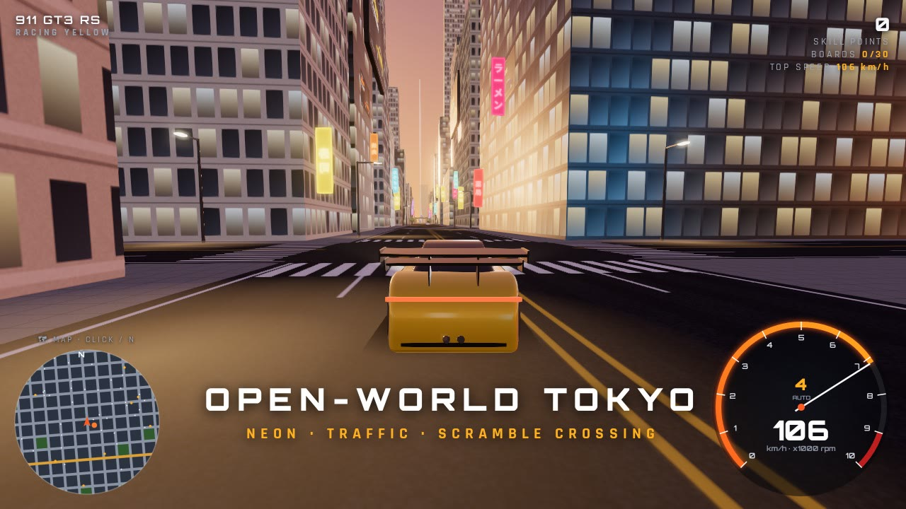

# AMBOOLA — Tokyo Open World

A browser driving game: take Porsche GT cars and SUVs, the whole Tesla lineup, Lamborghinis, Ferraris, McLarens and Bugattis through an open-world, Tokyo-inspired city covered in neon signs and Porsche billboards.

**▶ Watch the trailer:** [media/amboola-trailer.mp4](media/amboola-trailer.mp4) (54 s, recorded from the real game)

Everything is in one file, `index.html`: the city, the cars, the physics and the sound. No build step and no install.

## How to play

**Option 1 — just open it:** download `index.html` and double-click it. Chrome, Edge, Firefox and Safari all work.
An internet connection is needed the first time, because Three.js and the fonts load from a CDN.

**Option 2 — GitHub Pages:** in the repo go to *Settings → Pages*, choose *Deploy from a branch*, pick the branch and `/ (root)`,
then open the URL it gives you.

**Option 3 — local server:** `npx http-server .` and open `http://localhost:8080`.

## Controls

| Key | Action |
| --- | --- |
| `W` / `↑` | Throttle |
| `S` / `↓` | Brake, then hold to reverse |
| `A` `D` / `←` `→` | Steer |
| `Space` | Handbrake (drift) |
| `C` | Camera: chase / far chase / hood / bumper |
| `M` | Automatic ↔ manual gearbox |
| `Q` / `E` | Shift down / up (manual) |
| `T` | Time of day: day / sunset / night |
| `R` | Put the car back on the road |
| `P` / `Esc` | Pause, change car, sound on/off |
| `H` | Show controls |

Gamepads work too: RT/LT for throttle and brake, the left stick steers, A is the handbrake, Y changes camera, LB/RB shift, and Start pauses. On phones and tablets, touch buttons appear on screen.

## Cars

**GT:** 911 GT3 RS · 911 GT3 · 911 GT3 Touring · 911 S/T · 911 GT2 RS · 911 Turbo S · 718 Cayman GT4 RS · 718 Spyder RS · 911 Dakar
**Hypercar:** 918 Spyder
**Electric:** Taycan Turbo GT
**SUV:** Cayenne Turbo GT · Cayenne Turbo E-Hybrid · Macan Turbo Electric
**Lamborghini:** Revuelto · Aventador SVJ · Temerario · Huracán STO · Huracán Sterrato · Urus Performante
**Ferrari:** SF90 Stradale · LaFerrari · 812 Competizione · 12Cilindri · 296 GTB · F8 Tributo · Purosangue
**McLaren:** W1 · Senna · P1 · 765LT · 750S · Artura · GTS
**Bugatti:** Tourbillon · Chiron Super Sport · Chiron Pur Sport · Divo · Veyron Super Sport · Bolide
**Tesla:** Roadster (next-gen) · Roadster (2008) · Model S Plaid · Model 3 Performance · Model X Plaid · Model Y Performance · Cybertruck Cyberbeast

The Teslas have their own body shapes: glass roofs, smooth grille-less noses, and a flat-panel Cybertruck with a full-width light bar. They also get extra paints: Pearl White, Ultra Red, Stealth Grey, Quicksilver, Deep Blue, and brushed Stainless Steel for the Cybertruck. The next-gen Roadster uses Tesla's announced prototype figures (0–100 km/h in 1.9 s, 400 km/h).

The Lamborghinis have sharp, angular wedge bodies. The Ferraris come in three shapes: curvy mid-engine berlinettas, long-nosed front-engine V12 GTs, and the Purosangue. Both brands get their own paints: Verde Mantis, Arancio Borealis, Viola Pasifae, Rosso Corsa, Giallo Modena and Blu Pozzi.

The McLarens have a low mid-engine body with a teardrop cabin. The Bugattis have a wide, rounded body with the horseshoe grille, and the Bolide is a very low track car. The new paints are Papaya Orange, Volcano Blue, Bugatti Blue and Argent Silver. The Bugatti Tourbillon (2.0 s to 100 km/h, 445 km/h) and the track-only Bolide (500 km/h) are the fastest cars in the game.

Each car's physics is built from its real published figures: power, weight, redline, top speed, drivetrain and gear count. From those the game works out a torque curve, gear ratios and drag. For example, the GT3 RS reaches 100 km/h in about 3.2 s. The cars also have their own gearboxes (PDK, manual or single-speed EV), rev limiters, traction limits, downforce, brake distances, drifting and body roll. There are 30 paint colours.

## The world

- A 1.6 × 1.6 km city grid with left-hand traffic, as in Japan. Taxis, kei cars, vans and trucks drive around, stop for you and turn at junctions.
- A scramble crossing with giant video screens that cycle through the ads, plus rooftop and wall billboards.
- Vertical neon signs, vending machines, street lamps and cherry-blossom parks.
- A Tokyo-Tower-style landmark, a temple with a pagoda and torii gates, and an elevated expressway (Shuto) with its own traffic.
- A harbour district by the sea, and Mt. Fuji on the horizon.
- The Amboola GT Center showroom, where you start.
- **30 Amboola boards** to smash, **6 speed traps**, and **skill chains** for drifting, near misses and high speed.

## Map, search and GPS

**Click the minimap**, or press **N** (also P → MAP · SEARCH, or the gamepad Back button), to open the full map of the city, the mountain and all six race tracks.

- **Search** by typing in the box, in English or Japanese: districts (Shibuya 渋谷, Ginza 銀座, Akihabara…), landmarks (Tokyo Tower, Sensō-ji Temple, Scramble Crossing, Amboola GT Center), the Mt. Amboola viewpoint (展望台), race tracks and speed traps. Press **Enter** to pick the first result.
- **Drop a pin** by clicking anywhere on the map. Pins snap to the nearest road, the mountain road or a track.
- **Move around:** drag to pan, use the mouse wheel or **+ / −** to zoom, **◎** centres on your car and **⤢** shows the whole map.
- Each place shows its distance by road, and three choices:
  - **SET ROUTE:** blue arrows on the road and a blue line on the minimap guide you there, including over the mountain. A bar at the top shows the distance left, **TURN AROUND** tells you when you're facing the wrong way, and **ARRIVED · 到着** shows when you get there.
  - **TRAVEL HERE:** fast travel. You appear there straight away.
  - **🏁 RACE** (for tracks): starts that race.

## Outlaw

Pick any car in the garage and press **💰 OUTLAW**, or choose **P → OUTLAW** while driving.

- **Steal:** green money safes are hidden all over the city, with light beams and green squares on the minimap. Drive through one to crack it for ¥3,000–12,000.
- **The police come for you:** every theft alerts them. Police cars with flashing light bars and sirens chase you through the streets, and more come as you carry more cash (up to 3).
- **Don't get caught:** if a police car pins you while you're stopped or crawling, the **BUSTED** bar fills and they take everything you're carrying. Get more than 450 m away to lose them.
- **Take it to a hideout:** press **G** or the **🏠 HIDEOUT ROUTE** button, and purple arrows on the road lead you to the nearest hideout (隠れ家). Stop there to stash the money for good. The police can't arrest you at a hideout.

Your stashed total is saved. **P → END OUTLAW** stops.

## Police

Pick any car in the garage and press **🚓 POLICE**, or choose **P → POLICE** while driving. Now you're the one doing the chasing.

- **Find the outlaw:** an AI outlaw in a fast sports car (a 911 Turbo S, McLaren W1, Ferrari and so on) is cracking the money safes around the city. Red arrows on the road and a flashing red-and-white dot on the minimap lead you to him. The bar at the top shows his car, his distance, how much money he has, and whether he's **LOOTING**, **FLEEING** or **ESCAPING**.
- **He runs:** when you get close he flees. Once he has enough money he races to a hideout.
- **Catch him:** just **touch his car** with yours. He's arrested on the spot and **you get all the money he had**, plus a ¥5,000 reward.
- **Hideouts are safe for him:** you **can't arrest him at a hideout** (隠れ家). If he gets there with the money, he stashes it and gets away. Then a new outlaw appears somewhere in the city.

Your police rewards are saved. **P → END POLICE DUTY** stops.

## Mt. Amboola

There's a big forested mountain on the bay, south-west of the city. You can see it from the streets.

- **Getting there:** drive west to the red torii gate at the end of the west-edge road; the minimap shows it. Through the gate, a 2.8 km road winds twice around the mountain as it climbs, with guardrails and pine forest on both sides.
- **Driving it:** hills feel real. Climbing slows the car and going downhill speeds it up, and the car tilts with the road.
- **The top:** a viewpoint plaza at 208 m with railings, telescopes, a Japanese shelter, a torii gate and lamps. The haze clears as you climb, so the whole city and the sea are in view. You get +2,000 skill points the first time you reach the summit.
- **The scenic view:** stop on the plaza and wait about 2 seconds. The camera glides out over the railing and slowly pans across Tokyo. It's especially good at sunset and at night. Press any drive key to carry on.
- **Getting back:** drive back down and through the gate, and you're in the city again. **R** puts you back on the mountain road.

## Races

There are six race tracks just outside the city. You can see them from the city streets.

| Track | Where | Length | Laps |
|---|---|---|---|
| **Amboola Grand Prix Circuit** | East of the city | 4.05 km, technical, with lots of corners | 3 |
| **Fujimi Speedway** | North, under Mt. Fuji | 4.01 km with a 1.4 km main straight | 3 |
| **Bayside Oval** | West | 2.47 km, flat out | 5 |
| **Akagi Mountain Pass** | North-east | 3.41 km, narrow, with hairpins and walls right at the edge | 2 |
| **Kanto Short Circuit** | North-west | 1.93 km, tight club circuit | 4 |
| **Sakura Ring** | Far east | 8.54 km, flowing endurance loop | 1 |

**How to start a race:**
- **From the garage:** pick your car, press **🏁 RACES**, and choose a track.
- **While driving:** drive into a glowing race marker on the city's edge road (a coloured ring with a light beam and a sign), then press **Enter** or tap the prompt.
- **From the pause menu:** press **P / Esc → RACES**.

You race against 5 AI rivals whose power-to-weight is close to your car's. The rivals follow a racing line, brake for corners and overtake. There is a start-light countdown, then a live position and lap display, standings, a wrong-way warning, and **R** to reset onto the track.

After the finish you get a results table and skill points: 5,000 for a win, 3,000 for 2nd, 2,000 for 3rd. Your best race time and best lap for each track are saved. **P → LEAVE RACE** takes you back to the city.

## Taxi jobs

In the garage, pick **any car** and press **🚕 TAXI**, or choose **P → TAXI JOB** while driving. Your car stays exactly as it is.

1. **Find the passenger.** A passenger waits at the roadside, waving, under a yellow ring and light beam.
   - The minimap draws the route along the streets in yellow.
   - Glowing arrows on the road show the way, lane by lane. If the route starts behind you, the game says **TURN AROUND**.
2. **Pick them up** by stopping next to them. They get in and tell you where to go, for example Ginza, Shibuya, Akihabara, Odaiba Harbor or near Tokyo Tower. The route turns green and a timer starts.
3. **Drop them off** by stopping at the green marker. You get a fare based on the distance, plus a tip for arriving early. Crashes shrink the tip, and arriving late means no tip and a lower fare.
4. **Keep going.** The next passenger appears right away. The job bar at the top shows the task, distance, time left, money earned and number of fares. Your all-time earnings are saved. **P → END TAXI SHIFT** stops.

## Graphics

Three.js with physically based materials: clear-coat car paint and reflective glass lit by an environment map. It adds dynamic sun shadows, ACES tone mapping, bloom, SMAA anti-aliasing, fog and three times of day with lit windows at night. You can pick Ultra, High or Low graphics in the garage. Low is meant for laptops and phones.

## Sound

There are no audio files; all sound is generated live with the Web Audio API.
- **Combustion engines** are built from individual cylinder firing pulses passed through exhaust resonances. The pulse layers are cross-faded by RPM, so the engines each sound different: Porsche flat-six, V8, the 918's high-revving V8, the Lamborghini and Ferrari V12 shriek, the raspy Huracán V10, flat-plane twin-turbo V8s, the Ferrari 296's and McLaren Artura's twin-turbo V6, Bugatti's deep quad-turbo W16, and the Tourbillon's 9,000 rpm V16. The hybrids (Revuelto, Temerario, SF90, LaFerrari, 296, W1, P1, Artura, Tourbillon) also have an electric-motor whine.
- On top of that: throttle-dependent tone, a rev-limiter stutter, crackles when you lift off, shift cuts, and turbo whistle with blow-off valve on the turbo cars.
- **Porsche electric cars** have motor and inverter whine plus a low synthesized drive sound.
- **Teslas** are almost silent, like the real cars. You hear a clean motor and gear whine that climbs with speed, a regen whine when you lift off, and the low pedestrian-warning hum below 30 km/h.
- **Around the car:** tyre squeal, road rumble, wind noise, crash sounds and board smashes.

---
*Fan-made game. Not affiliated with or endorsed by Porsche, Tesla, Lamborghini, Ferrari, McLaren or Bugatti. Model names are used only to identify the cars.*
